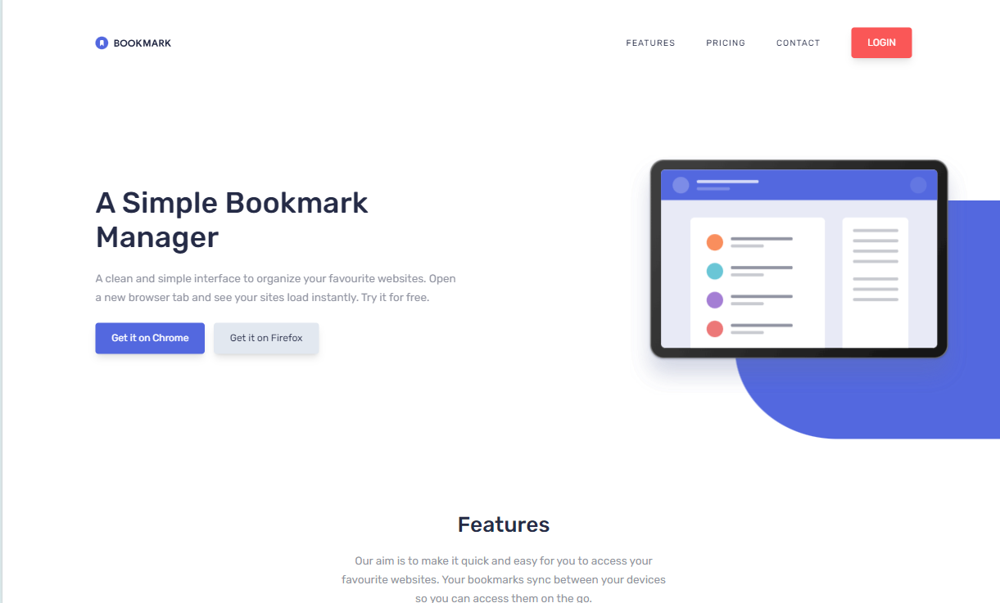

# Frontend Mentor - Bookmark Landing Page Solution

This is a solution to the [Bookmark landing page challenge on Frontend Mentor](https://www.frontendmentor.io/challenges/bookmark-landing-page-5d0b588a9edda32581d29158). Frontend Mentor challenges help you improve your coding skills by building realistic projects.

## Table of contents

- [Overview](#overview)
  - [The challenge](#the-challenge)
  - [Screenshot](#screenshot)
  - [Links](#links)
- [My process](#my-process)
  - [Built with](#built-with)
  - [What I learned](#what-i-learned)
  - [Continued development](#continued-development)
  - [Useful resources](#useful-resources)
- [Author](#author)
- [Acknowledgments](#acknowledgments)

## Overview

### The challenge

Users should be able to:

- View the optimal layout for the site depending on their device's screen size 📱💻
- See hover states for all interactive elements on the page 🖱️
- Receive an error message when the newsletter form is submitted if:
  - The input field is empty ❌
  - The email address is not formatted correctly 📧

### Screenshot



### Links

- [Solution](https://github.com/naijadevgamer/bookmark-landing-page)
- [Live Site](https://naijadevgamer.github.io/bookmark-landing-page)

## My process

### Built with

- Semantic HTML5 Markup 🏷️
- Tailwind CSS - For styling effortlessly 💅
- JavaScript - For interactive elements ✨
- Webpack - To bundle my assets 📦
- GSAP for animations 🎨💥

### What I learned

This project was so much fun! 🎉 I learned a lot about GSAP animations and how to make them interactive and responsive. Here are some cool snippets:

```js
gsap.to(".disp-img", {
  scrollTrigger: {
    trigger: ".disp-img",
    scrub: 0.1,
    start: "top 240px",
  },
  yPercent: 33,
  scale: 1.1,
});
```

I also got better at using Intersection Observer API for lazy loading sections and adding animations. Check this out:

```js
const reveal = (entries, observer) => {
  const [entry] = entries;
  if (!entry.isIntersecting) return;
  entry.target.classList.remove("section--hidden");
  observer.unobserve(entry.target);
};
const revealSectionObserver = new IntersectionObserver(reveal, {
  threshold: 0,
});
allRevealSection.forEach((sect) => revealSectionObserver.observe(sect));
```

I also implemented cool scroll-triggered animations like text trick using the Intersection Observer API and many more. 🌟

### Continued Development

Moving forward, I want to focus on:

- Enhancing my animation skills using GSAP 🎥
- Improving my understanding of responsive design principles for - better layouts on all devices 📐
- Digging deeper into accessibility to make my websites more user-friendly ♿
- I am also yet to implement the animated carousel i wish to implement

## Author

Feel free to reach out if you have any questions or suggestions. I’d love to hear from you! 😊

- **Email**: [sabdullahialaba50@gmail.com](mailto:sabdullahialaba50@gmail.com)
- **LinkedIn**: [Abdullah Saleeman](https://www.linkedin.com/in/abdullah-saleeman-360170243)
- **GitHub**: [My GitHub Profile](https://github.com/naijadevgamer)
- **Twitter**: [@naijadevgamer](https://www.twitter.com/naijadevgamer)
- **Instagram**: [@naijadevgamer](https://www.instagram.com/naijadevgamer)

## Acknowledgments

I extend my gratitude to the Almighty ALLAH for guiding me through this project.

These resources were invaluable during my project:

- [**GSAP Documentation**](https://gsap.com/docs/v3/) - This helped me understand how to use GSAP for animations. It's very detailed and easy to follow.
- [**Tailwind CSS Documentation**](https://tailwindcss.com/docs) - A great reference for using Tailwind CSS. It made styling so much easier!
